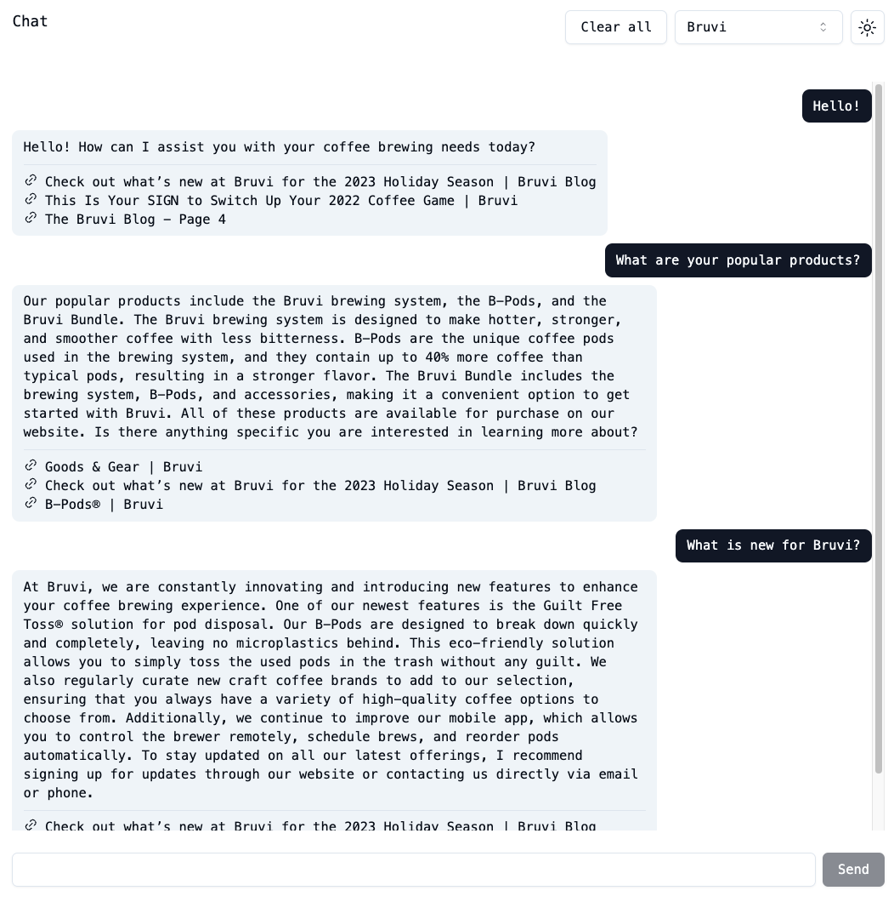
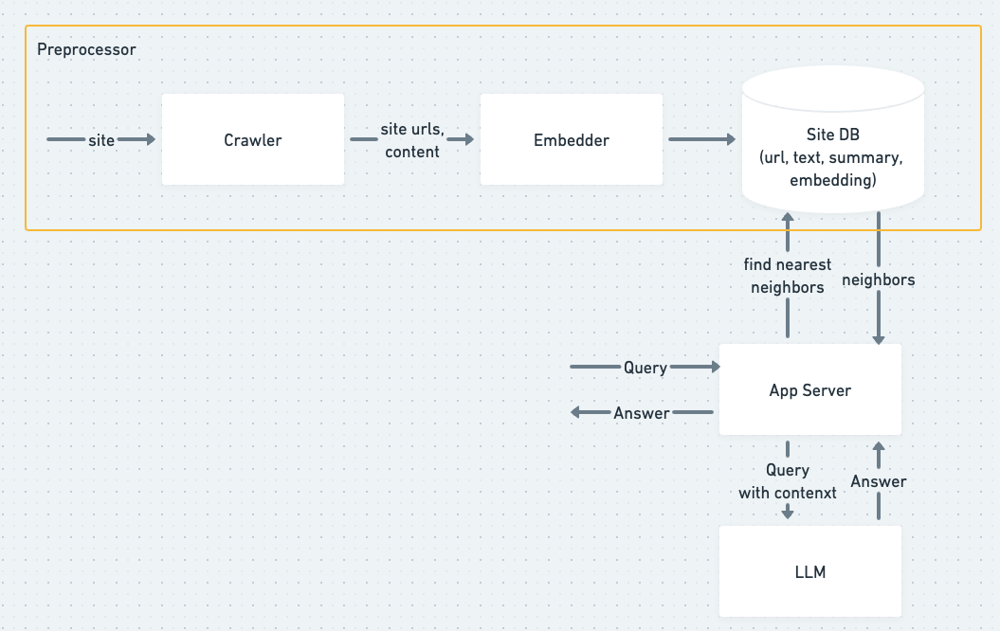

# Chatter

The <b>Chat</b>bot Star<b>ter</b> (with RAG). This project is a demo for a chatbot with RAG functionality. The chatbot will act as George, a virtual sales agent for a coffee machine brand Bruvi to answer the user's questions with references to the pages on Bruvi website. The project also demonstrates serving with different model types: `human`, `custom hosted model`, `OpenAI with RAG`. The user can toggle the model from the UI.

The project is designed for educational purpose, with only the minimal and most essential dependencies. It can be used to understand how the system operates under the hood, and is easily customizable.

## UI



## RAG diagram

The diagram below shows the flow of RAG. This repo only implements the online part. The offline part is in the [scrapy-demo](https://github.com/minfawang/scrapy-demo) repo.



## Tech stack

- [x] [Next.js](https://nextjs.org/) (Frontend, SSR)
- [x] [Supabase](https://supabase.com/) (Database, PubSub)
- [x] [FastAPI](https://fastapi.tiangolo.com/) (Backend)
- [x] [pipenv](https://pipenv.pypa.io/en/latest/) (Python virtual management)
- [x] [shadcn/ui](https://ui.shadcn.com/) (UI components, Tailwind CSS)

It uses numpy to build the in-memory "vector database" for RAG.

## Getting Started

### First time

Update `SUPABASE_PROJECT_URL` and `SUPABASE_ANON_KEY` in [supabase.tsx](app/supabase.tsx) if necessary.

Also, create `.env` file. See [.env.example](/.env.example) for an example.

### Dev

Run the backend server:

```bash
pipenv shell
cd api
uvicorn index:app --reload
```

Run the frontend development server:

```bash
npm run dev
```

Open [http://localhost:3000](http://localhost:3000) with your browser to see the result.
